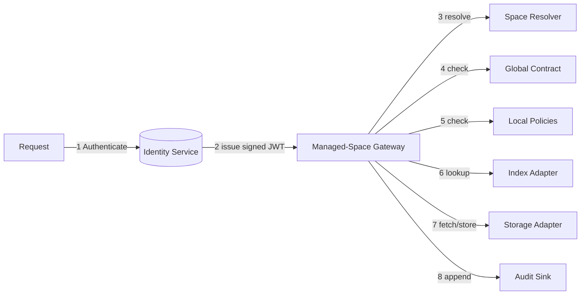
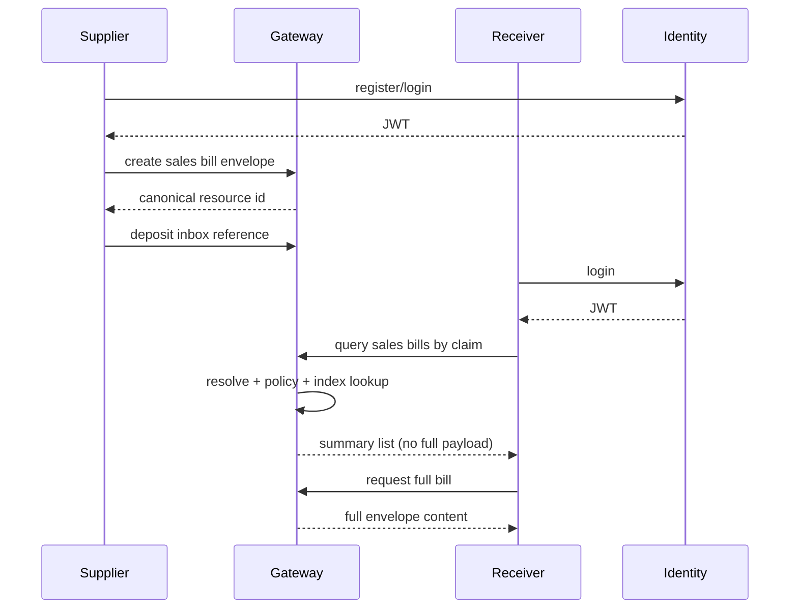

# OpenMSA (.NET)

OpenMSA is an open-source managed-space reference implementation in .NET 9 designed for governed, decentralized data spaces.

It intentionally avoids exposing raw folder structures or filesystem paths. A **Managed Space** is a logical boundary with fixed sections, local policy and manifest metadata, and request-by-request authorization through a gateway.

## Why OpenMSA instead of a filesystem abstraction

OpenMSA is not a filesystem clone. Every access must be authorized through:

- a bearer token (identity + intent),
- section + operation validation,
- policy evaluation,
- and an index lookup.

Raw directory traversal/listing is intentionally unavailable.

## Architecture at a glance



## Sales-bill sample flow



## Core ideas

- **Governed decentralization** – fixed structure comes from a global contract; owners can only configure within allowed boundaries.
- **Stateless authorization** – each request is independently validated.
- **Asymmetric identity trust** – JWTs signed with asymmetric keys; only public key material is exposed to gateways.
- **Local policy and local index** – per-space policy + fast indexed lookup.
- **Write-only inbox** – external users can deposit, but cannot enumerate/read deposited objects.

## API

Example API in this repository:

- `POST /v1/auth/register`
- `POST /v1/auth/login`
- `GET /.well-known/jwks.json`
- `POST /v1/spaces`
- `GET /v1/spaces/{spaceRef}/manifest`
- `POST /v1/spaces/{spaceRef}/inbox`
- `GET /v1/spaces/{spaceRef}/resources`
- `GET /v1/spaces/{spaceRef}/resources/{resourceId}`
- `POST /v1/spaces/{spaceRef}/resources`
- `PATCH /v1/spaces/{spaceRef}/resources/{resourceId}`
- `DELETE /v1/spaces/{spaceRef}/resources/{resourceId}`

## Technology decisions

- **Runtime:** ASP.NET Core / .NET 9
- **Token validation:** JWT with RSA signatures via `System.IdentityModel.Tokens.Jwt`
- **Password hashing:** Argon2 via `Isopoh.Cryptography.Argon2`
- **Index:** SQLite local adapter via `Microsoft.Data.Sqlite`
- **Tests:** xUnit

This repository is currently the **initial, non-production-ready** reference implementation.

## Get started

```bash
dotnet restore
dotnet build
dotnet test
```

Run example API:

```bash
dotnet run --project apps/example-server/ExampleServer.csproj
```

## Security note

This code is intentionally conservative, but not production hardened. In particular, this scaffold:

- keeps key storage simple for local development,
- does not include full revocation or replay protections by default,
- and should be reviewed before using in production.

## Contributing

See `CONTRIBUTING.md`, `CODE_OF_CONDUCT.md`, and `SECURITY.md` before filing issues or PRs.

## License

MIT © 2026 Suraj Kumar.
